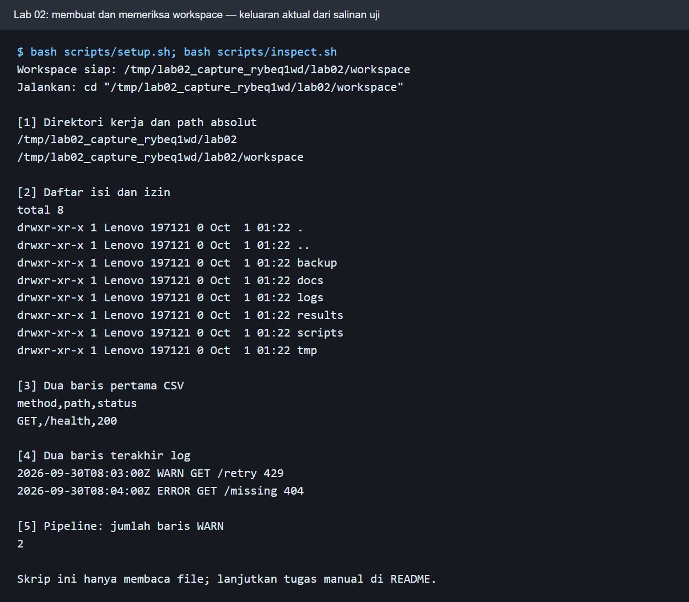
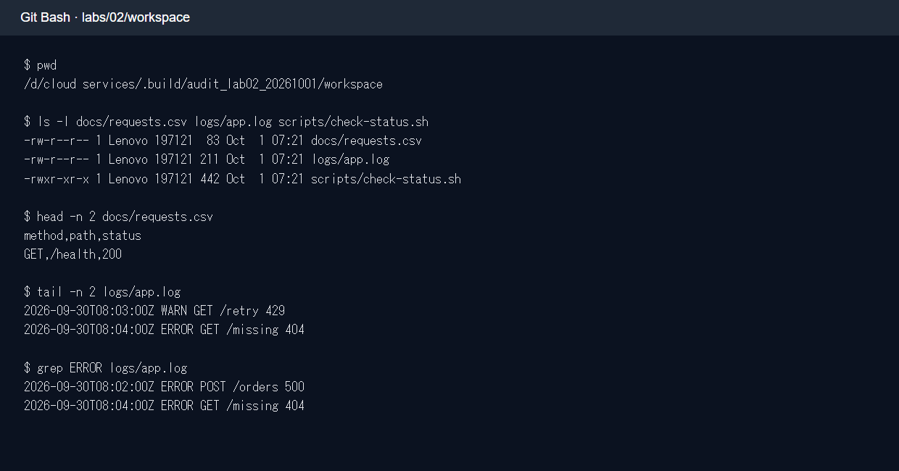
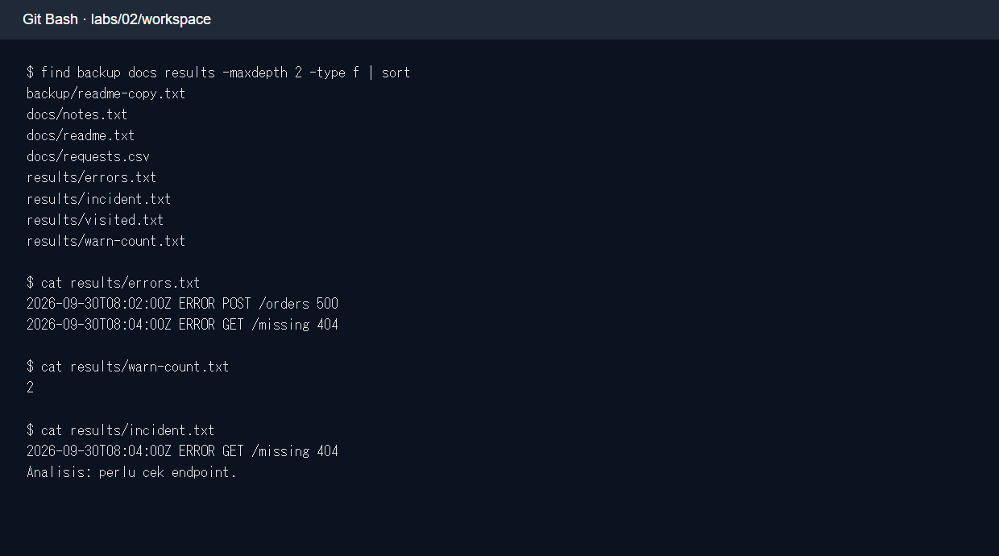
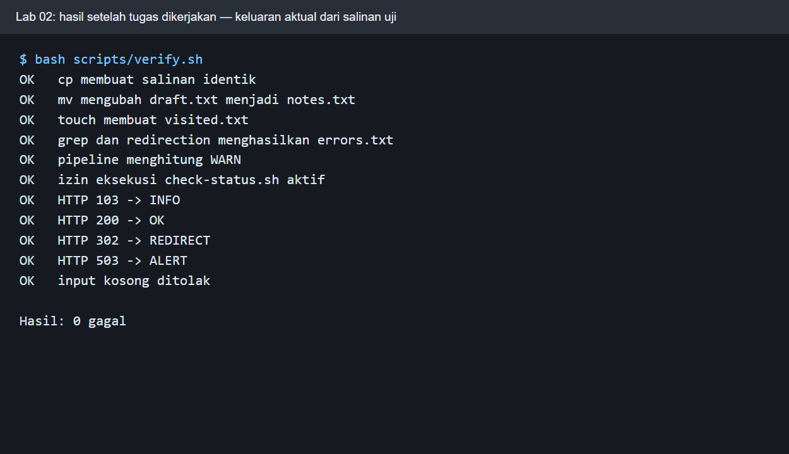
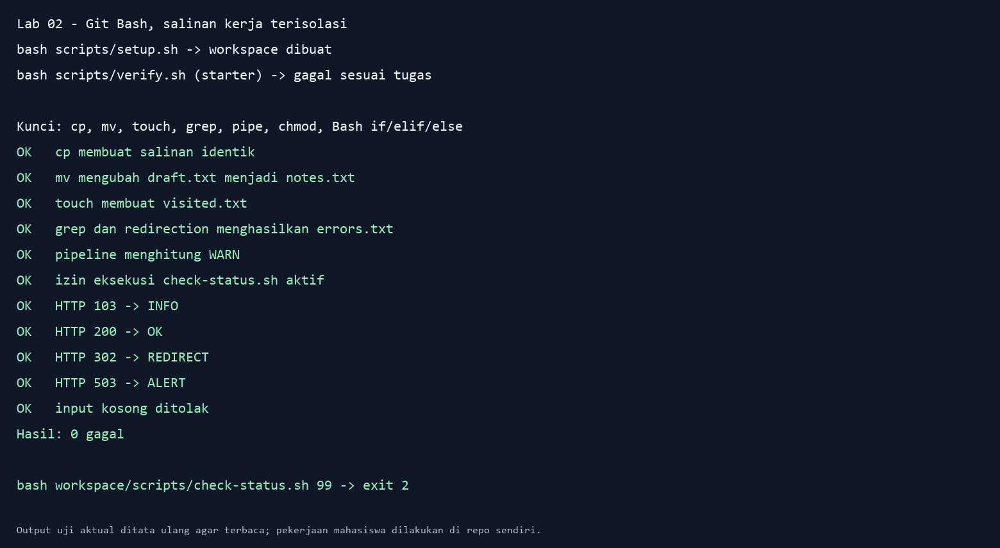

# Panduan dosen Lab 02 — Linux, berkas, izin, dan Bash

**Durasi demo:** 90 menit. **Capaian:** mahasiswa memakai path absolut/relatif, mengolah file dan log, membedakan pipe/redirection, membaca `rwx`, serta melengkapi skrip klasifikasi HTTP. Gunakan repo mandiri `SeedFlora/meet2CloudService`, [modul mahasiswa](MODUL_MAHASISWA.md), dan [panduan Git](PANDUAN_GIT.md). Semua command `.sh` harus dijalankan di Bash (Git Bash/WSL/Linux/macOS/Codespaces), bukan terminal PowerShell biasa.

## Pra-kelas

1. Clone atau buka repo Lab 02; pastikan root repo memuat `scripts/`, `starter/`, dan `MODUL_MAHASISWA.md`. Di Windows pilih **Git Bash**; pada komputer uji, mengetik `bash` di PowerShell dapat memanggil WSL yang belum siap. Gunakan jendela Git Bash yang nyata.
2. Jalankan `bash -n scripts/setup.sh scripts/inspect.sh scripts/verify.sh starter/check-status.sh` untuk memeriksa sintaks. Jangan mengedit `starter/check-status.sh` pada repo template karena TODO adalah bagian tugas.
3. Kerjakan demonstrasi pada **salinan repo**. `setup.sh` tidak menimpa `workspace/` jika sudah ada; jangan hapus workspace mahasiswa. Sebelum kelas, tunjukkan bahwa verifier awal gagal sesuai desain.
4. Tidak perlu Docker, `sudo`, akun cloud, atau internet setelah repo tersalin. Semua file latihan berada di `workspace/` dan aman untuk diulang pada salinan baru.

## Alur 90 menit

| Menit | Dosen | Mahasiswa | Checkpoint |
|---:|---|---|---|
| 0–10 | Jelaskan `/`, `/home`, `/etc`, `/var`, `/tmp` serta working directory. | Buka Bash, jalankan `pwd`. | Dapat membedakan root filesystem dan root repo. |
| 10–20 | Jalankan `bash scripts/setup.sh`, `inspect.sh`. | Periksa enam subfolder workspace. | `WARN` = 2; file contoh terbaca. |
| 20–35 | Demo `cd`, `ls -la`, `find`, `head`, `tail`, `grep`. | Catat path relatif/absolut yang sama. | Baris CSV/log sesuai. |
| 35–50 | Tunjukkan `cp`, `mv`, `touch`, pipe, `>` dan `>>`. | Buat lima artefak tugas. | `errors.txt` dua baris; `warn-count.txt` = 2. |
| 50–68 | Terangkan regex, `$1`, `if/elif/else`, stdout/stderr, exit code. | Isi skrip TODO, `chmod u+x`. | 103/200/302/503 diklasifikasikan. |
| 68–78 | Jalankan `bash scripts/verify.sh` dan baca kegagalan satu per satu. | Perbaiki sampai 0 gagal. | `Hasil: 0 gagal`. |
| 78–90 | Bahas lima pertanyaan, Git status/diff, pengumpulan. | Simpan laporan dan bukti pribadi. | Commit tanpa token/data pribadi. |

## Demo command dan penjelasan tiap tahap

Dari **root repo**:

```bash
pwd
bash scripts/setup.sh
bash scripts/inspect.sh
cd workspace
pwd
ls -la
head -n 2 docs/requests.csv
tail -n 2 logs/app.log
grep 'ERROR' logs/app.log
```

`pwd` memberi lokasi absolut. `setup.sh` membuat data sekali, `inspect.sh` hanya membaca. `cd workspace` mengubah basis path relatif. `head` menunjukkan header dan baris CSV pertama, `tail` menunjukkan akhir log, `grep` memilih dua baris error. Saat menjelaskan permission, uraikan tiga kelompok bit pada `ls -l`: pemilik, grup, lainnya.

Kunci lima artefak dari `workspace/`:

```bash
cp docs/readme.txt backup/readme-copy.txt
mv docs/draft.txt docs/notes.txt
touch results/visited.txt
grep 'ERROR' logs/app.log > results/errors.txt
grep 'WARN' logs/app.log | wc -l > results/warn-count.txt
```

`cp` mempertahankan sumber, `mv` memindahkan/menamai ulang, `touch` membuat penanda. Pipe membawa stdout `grep` ke `wc`; `>` menulis hasil ke file. `>>` dapat dicoba dengan `printf 'Analisis...\n' >> results/incident.txt` untuk memperlihatkan append tanpa mengubah log asal. Jangan gunakan `rm -rf` pada path hasil tebakan.

## Kunci seluruh skrip dan verifikasi

Mahasiswa mengedit **`workspace/scripts/check-status.sh`**, bukan `starter/check-status.sh` atau `scripts/verify.sh`. Bila editor tidak bisa dipakai, dari dalam `workspace/` perintah heredoc di bawah langsung menulis file. `<<'EOF'` mempertahankan literal `$code` sampai skrip dijalankan:

```bash
cat > scripts/check-status.sh <<'EOF'
#!/usr/bin/env bash
set -euo pipefail
code="${1:-}"
if [[ ! "$code" =~ ^[1-5][0-9][0-9]$ ]]; then
  printf 'Usage: check-status.sh <HTTP-code>\n' >&2
  exit 2
elif (( code < 200 )); then
  printf 'INFO: HTTP %s\n' "$code"
elif (( code < 300 )); then
  printf 'OK: HTTP %s\n' "$code"
elif (( code < 400 )); then
  printf 'REDIRECT: HTTP %s\n' "$code"
else
  printf 'ALERT: HTTP %s\n' "$code"
fi
EOF
```

Regex menolak kosong, huruf, dua digit, dan 600+. `>&2` menulis usage ke stderr. `exit 2` khusus argumen salah; input 503 tetap exit 0 karena klasifikasinya berhasil. Sesudah menyimpan:

```bash
chmod u+x scripts/check-status.sh
./scripts/check-status.sh 103
./scripts/check-status.sh 200
./scripts/check-status.sh 302
./scripts/check-status.sh 503
./scripts/check-status.sh 99
echo "$?"
cd ..
bash scripts/verify.sh
```

Hasil berurutan `INFO`, `OK`, `REDIRECT`, `ALERT`, pesan `Usage` + exit 2, dan verifier **0 gagal**. Pada uji ulang di Git Bash dalam salinan terisolasi, starter memberi **10 gagal** sebelum tugas, lalu solusi di atas memberi **0 gagal**. Validasi input 99 juga memberi exit 2.

## Screenshot yang dijelaskan saat demo



**Perintah:** `bash scripts/setup.sh && bash scripts/inspect.sh`. **Fungsi:** membuat dan memeriksa data awal. **Cara kerja:** setup menulis CSV/log/kerangka skrip, inspect membacanya. **Baca:** enam subfolder dan `WARN` = 2.



**Perintah:** `pwd`, `ls -la`, `head`, `tail`, `grep`. **Fungsi:** membaca file tanpa mengubahnya. **Cara kerja:** path relatif dihitung dari direktori aktif. **Baca:** posisi saat ini, bit izin, dan baris log terpilih.



**Perintah:** `cp`, `mv`, `touch`, `grep >`, `grep | wc -l >`. **Fungsi:** membuat bukti kerja. **Cara kerja:** shell menangani pipe dan redirection. **Baca:** `notes.txt`, `errors.txt` dua baris, `warn-count.txt` = 2.



**Perintah:** `bash scripts/verify.sh`. **Fungsi:** mengecek file, permission, empat kategori HTTP, dan input kosong. **Cara kerja:** skrip menghitung kegagalan tanpa memperbaiki file mahasiswa. **Baca:** semua `OK`, akhir `Hasil: 0 gagal`.



**Perintah:** setup, lima operasi file, isi skrip, chmod, verify. **Fungsi:** bukti solusi terkini. **Cara kerja:** uji dijalankan pada salinan terisolasi agar starter repo tetap TODO. **Baca:** awal 10 gagal, akhir 0 gagal, input 99 exit 2. Cuplikan transkrip aktual ditata agar terbaca.

## Kunci lima pertanyaan dan diagnosis

1. Path absolut hasil `realpath workspace/logs/app.log` menunjuk file yang sama dengan `workspace/logs/app.log` dari root repo atau `logs/app.log` dari dalam workspace.
2. `|` menghubungkan proses, `>` mengganti file tujuan, `>>` menambah akhir file.
3. `chmod u+x` memberi hak execute langsung; `bash file.sh` meminta Bash membaca script sehingga execute bit pada file tidak wajib.
4. `rwx` berlaku terpisah untuk pemilik/grup/lainnya. `sudo` dan `chown` hanya untuk operasi sah yang memerlukan hak lebih; tidak dipakai di sini.
5. HTTP 103 berarti informasi dan 503 gangguan server; exit code 0 berarti skrip berhasil mengklasifikasikan inputnya.

Jika verifier gagal, minta mahasiswa membaca baris FAIL tepatnya: `cmp` berarti salinan salah, `mv` berarti file lama masih ada, `grep` berarti jumlah/konten salah, status HTTP berarti skrip atau teks output berbeda, permission berarti `chmod` belum dilakukan. `setup.sh` tidak mereset workspace; untuk mulai ulang gunakan **salinan repo baru**, bukan menghapus path siswa tanpa izin.

## Pengumpulan dan batas uji

Laporan `hasil/lab02.md` dibuat dari `hasil/TEMPLATE_LAPORAN.md`. Bukti pribadi masuk `hasil/bukti/`. Sebelum commit, gunakan `git status --short`, `git diff --check`, `git add scripts starter workspace hasil/lab02.md hasil/bukti`, `git diff --cached --name-only`, `git diff --cached --check`, lalu commit/push. Pastikan tidak ada token/berkas pribadi di workspace.

**Teruji pada komputer ini:** sintaks semua skrip Bash, setup/inspect, verifier merah pada starter, seluruh solusi pada salinan Git Bash, `Hasil: 0 gagal`, dan input salah exit 2. Jalur WSL/macOS/Codespaces mengikuti Bash yang sama, tetapi run ulang kali ini memakai Git Bash Windows.
